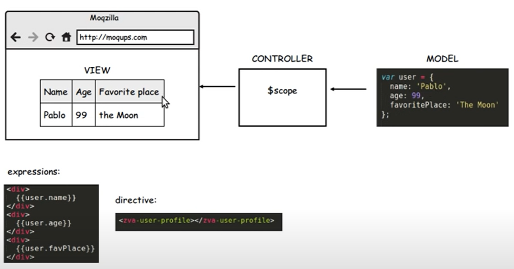

<<<<<<< HEAD
#angularJS
==========

## routing
    1. #(hash)로 location을 만든다.
    2. html을 주입한다.
## ngRount
    1. angular.js다음에 include하라.
    
=======
Single Page Application 관련 기술들
==================================

## angular개념

- angular-ui-route를 쓰는게 좋겠다.
    - 장점
        - multi view, nested를 쓸 수 있다
        - state에 많은 기능이 있다

## indexedDB

>>>>>>> 69a95d770d1f3486d4ad4fb2d0e618620df59852
