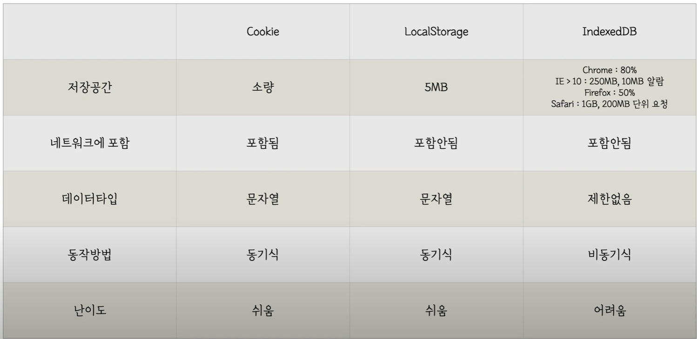

Single Page Application 관련 기술들
==================================

## angular개념

- angular-ui-route를 쓰는게 좋겠다.
    - 장점
        - multi view, nested를 쓸 수 있다
        - state에 많은 기능이 있다

## indexedDB

