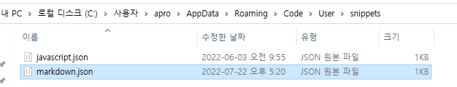

# technical note

## 참조

[Flowbite](https://flowbite.com/docs/components/navbar/)

## tailwind

- [plugin](https://tailwindcss.com/docs/plugins)을 이용할 수 있다. 만드는 것 까지는 힘들듯. 예를 들어 [버튼](https://tailwindcss-base-buttons.netlify.app/#themeColors)

## tailwind nav

```html

```

## tailwind login

```html

```

## custom snippet

- [나만의 snippet만들기](https://jojoldu.tistory.com/491)

  1. ctrl+shift+p -> snippet
  2. 선택 md인지 js인지
  3. 작성
  4. Ctrl + Space

  

## directive

- 전형적인 템플릿
  main.js에서

```javascript
module.exports = function () {
  return {
    restrict: 'E',
    scope: {},
    templateUrl: 'app/components/layout/footer.tpl.html',
    compile: (tElement, tAttribute) => {
      console.log(tAttribute.text + ' in Compiler');
      return {
        pre: function (scope, iElement, iAttributes, controller) {
          console.log(iAttributes.text + ' In Pre');
        },
        post: function (scope, iElement, iAttributes, controller) {
          console.log(iAttributes.text + ' In Post');
        },
      };
    },
    controller: (scope, element, attrs) => {
      console.log(attrs.text + ' In Controller');
    },
  };
};
```
