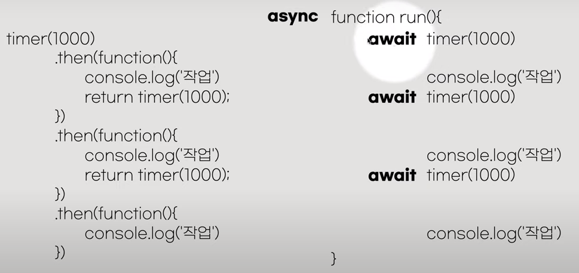

Javascript 여러가지 기술들
=========================

## promise

- Promise 는 Javascript class이다.
    - 즉 new로 생성
- State : pending -> fulfilled or rejected
- Producer 와 Consumer가 있다.

```javascript
//1. Producer
const promise = new Promise( (resolve, reject)=>{
    // 바로 수행된다
});

- resolve 성공시와 reject 실패시 수행하는 두개의 인자를 갖는 함수
- new 하는 순간 바로 executor가 수행된다.

```

## async & await

-  timer(100) 과 같이 promise를 리턴하는 함수를 그냥 쓰고 싶다.
```javascript
    timer(100);
    console.log('111');
    timer(200);
    console.log('222);
```
그래서  await 와. async를...
```javascript
await timer(1000);
await timer(2000);
-->
// await는 함수 안에서 사용되어야하는데, 그 함수 앞에는 async가 붙어야한다.
async function run(){
    await timer(1000);
    await timer(2000);
}
run();
```

## 사이트

- jsonplaceholder json데이터 제공
