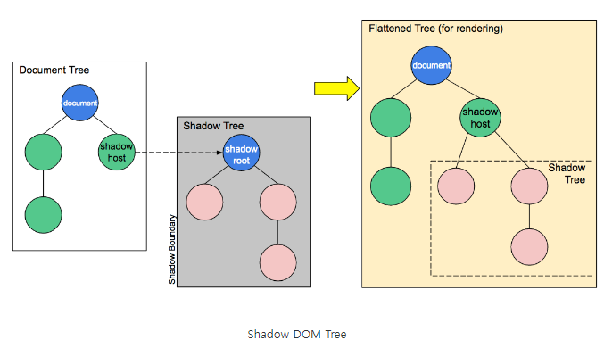

vanilla javascript custom tag
=============================

## 내용

[블로그를 보고 따라함](https://www.section.io/engineering-education/how-to-create-a-web-component-with-vanilla-javascript/)

[web component를 만들어서 npm에 등록한다](https://enumclass.tistory.com/225)

## component

1. custom elements
2. shadow DOM
3. HTML Template

## shadow DOM

- 자체적인 DOM 모델
- 스타일규칙도 해당범위에서 동작한다.
- 
## note

1. template element 생성
2. class 생성 HTMLElement에서 상속받는다.
    - mode 'open' javascript로 접근할 것인지 여부
3. 4개의 events
    - connectedCallback : HTML document DOM에 insert될 때
    - disconnectedCallback : HTML document DOM에서 remove될때
    - adoptedCallback : 다른 HTML document로 이동할때
    - attributeChangedCallback : attribues가 변경될 때
